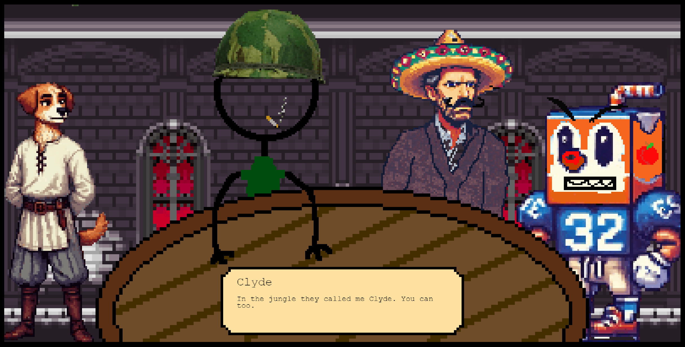

# The Fateful Five



**The Fateful Five** is a browser-based game built with [Phaser](https://phaser.io/) and Vite, hosted at [fiveguysmurdersandlies.us](https://fiveguysmurdersandlies.us). The game centers around four unique characters and an immersive storyline.

## Characters
- **Teddy K. the Dog** - Loyal and ever-present companion
- **Clyde** - A hardened Vietnam War vet
- **Dr. Casa** - A snide M.D. with a thoughtful sombrero
- **AJ Sampson** - A former football player, now an apple juice carton

## Features
- **Authentication**: Auth0 integration for username-based authentication
- **Dynamic Gameplay**: Built with Phaser for responsive, interactive experiences
- **Accessibility Hardware Addon**: Can be found at https://github.com/BALD-rs/Hack-K-State-2024-Hardware

## Setup & Development
1. Clone this repository:
   ```bash
   git clone https://github.com/your-username/the-fateful-five.git
   ```
2. Navigate to the project directory:
   ```bash
   cd the-fateful-five
   ```
3. Install dependencies:
   ```bash
   npm install
   ```
4. Start the development server:
   ```bash
   npm run dev
   ```
5. Access the game at `localhost:3000` (or the configured port).

## License
This project is licensed under the GPL-3.0 License.
